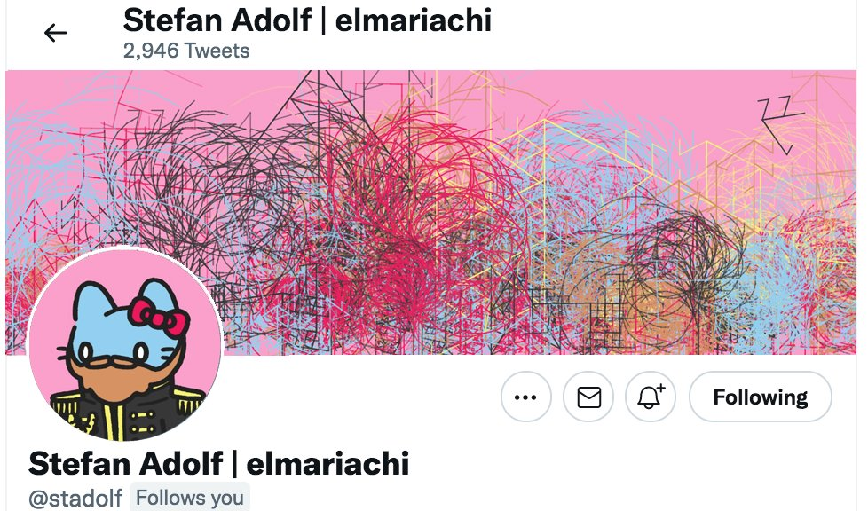
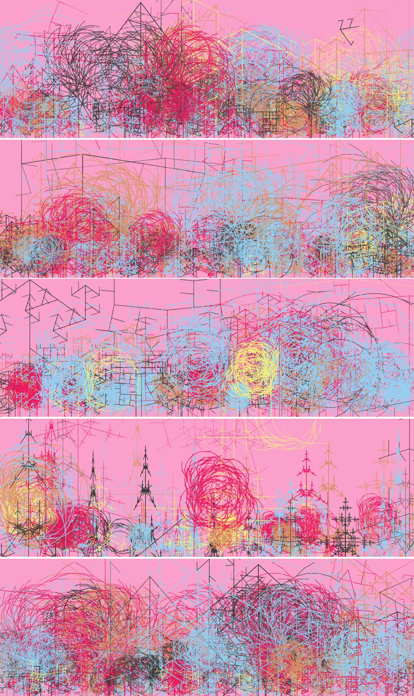
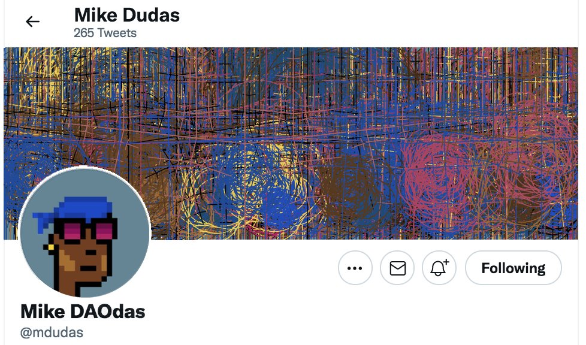
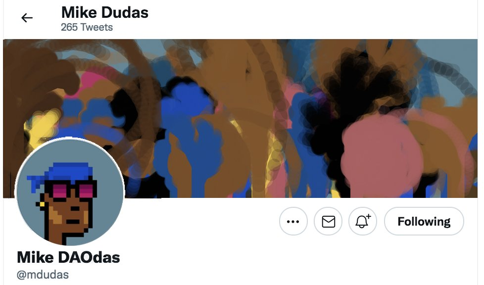

# Build generative NFTs out of other NFTs

> "Can you breed an Ape with a Cat and what would be the result?"

## Motivation

A lot of NFT owners who use their NFT images as avatars for their social profiles also decide to change their header images accordingly. End of August we stumbled upon [this tweet](https://twitter.com/MagnificentNFT/status/1432743465608171523) and accordingly, some well known investors in the NFT space are showing off their valuable belongings in their Twitter profiles, eg. punk owner [@iamDCinvestor](https://twitter.com/iamDCinvestor).

Our idea is to build a new kind of generative art NFT that uses existing NFT images to create a new NFT that's primarily focused on (but not restricted to) usage as a recognizeable header image for social profiles. Here are some examples we crafted during the ideation process (thanks, Emily!)

## Brainstorming

In a nutshell...

1 you already own an NFT and our protocol generates another one out of its features. Results should somewhat resemble the inputs, so others will recognize their origin and the minter can use it in addition to the NFT profile picture, e.g. as Twitter header image. Our teammate Emily has built some PoCs, using L-systems as generators.

2 do this with more than 1 NFT (Apes & Cats & Penguins).

### Feature extraction

the resulting artwork should resemble visual features of its inputs, so a viewer can recognize the origin if they think about it. The easiest way for making something recognizeable is to extract colors and styles and reuse them in the generative code.

The reason why this never has been done before (in code) seems to be related to the oracle problem: most popular NFTs are not relying on onchain data but store it outside the deterministic chain state (preferably using IPFS but also using centralized servers). The code that extracts features, either by reading plain metadata or by analyzing the original NFT images must therefore be validated by a trustful peer group, e.g. by using oracle networks.

Metadata features (traits) of NFTs are unique to each collection and not standardized. They define visual features of collections, e.g. laser eyes on BAYC or bows on cool cats. Only few collections open source their original layers, so if you wanted to use this information for your own creations you must give your algorithm a notion of what "laser eyes" actually mean.

### Artistic primitives

When brainstorming we found that Lindenmeyer (L-) systems, fractals, Brownian motions and 80s cyberpunk artwork might be great primitives to build upon. We've put an incomplete list of sources on these in the link section below.

### time based variations

Emily came up with the idea to not only generate a fixed image from the inputs but even consider outside effects, like weather conditions of the minters' locations, their zodiac signs, their token balances etc. Another idea might be to render the resulting NFT differently depending on the conditions at the time viewing (in winter it contains snow elements, in summer cacti), but that certainly depends on the viewer's perspective (e.g. if they're located on the northern or southern hemisphere or if they're close to the equator)

### Collaborative minting

assume two parties want to "breed" their NFTs to a new artwork. Who owns the result? Will there be two identical pieces? Or two pieces with similar traits but generated in a way, that each origin retrieves a piece that looks slightly closer to their original art than the other? One solution for this issue could be to use an ERC-1155 collection that allows all origins to "print" a copy for their NFT from the resulting artwork.

### Generative algorithms as NFTs

Ideally, every component that was involved creating the result should be living on chain. That includes the generative art algorithm. Projects like EthArtBlocks let their artists store JS/WASM based algorithms on IPFS so users can download and execute them on their browser environments. The artist / coder who created an NFT art generator should receive royalties if their algorithm is used for minting.

### Bonded minting fees

Minting of this artwork shouldn't be free. Instead, we're suggesting a minting fee that correlates to the current value of the origin assets. Since there's no commonly trusted source of pricing for NFTs, this price must be determined by another oracle that collects prices from various outside sources (with OpenSea and Rarible being the most likely sources). The price range of an NFT can be determined considering various parameters:

- highest current bid on an NFT
- floor price of NFTs in that collection with similar traits
- last sale prices of that NFT or its siblings

Chainlink and The Graph might be good technologies to reason about these parameters.

## Prior art

We're in touch with [EthBlockArts](https://ethblock.art/). They got a basic (but production proven) infrastructure for NFT generation and follow the idea that the generative code itself is anchored on chain as NFT. What they can't do right now, is extracting features from an existing NFT to use as seed | parameters for the new artwork. And there's a reason why they can't do this: if the process should be deterministic, you can't simply read metadata / image data from the origins - their extraction must be rooted in a trusted environment (hence I firmly believe this only can be achieved by using oracles).

### Requirements / Tasks for participants

1. think about the oracle problem for trustful feature extraction (Solidity, Chainlink & alike, potentially Go or TS)
2. think about the EthBlockArt integration & invent nontrivial, recognizable artworks out of existing NFTs (mainly JS, eventually WASM and a slight idea of Solidity)
3. think about the economic aspects: who would stake as a validator for feature extraction? Who would pay for the generation? What happens to the generative art if you sell the origin NFT? When more than one actor locks an origin NFT: who gets the result (or should in that case the result be an 1155 with as many prints as there were origins?) -> Solidity & token economics.

## Examples

- https://opensea.io/collection/tenth is a collection of **handdrawn** derivatives that all cost 10Eth.
- https://twitter.com/ilyakazakov/status/1431327560047239168 is an ongoing piece of handdrawn art that shows all major NFT memes in one picture
- https://opensea.io/collection/pop-wonder-editions POP Wonder manually creates interpretations of popular NFT collections
- https://twitter.com/skylineNFT SkylineNFT renders mountain views and puts them on Solana (not launched yet)
- https://twitter.com/Parametrise_NFT/status/1437503169584640008 Parametrize concentrates on creative generative art for Twitter background images

### on chain generative arts

A great read on flavours of OnChain SVG NFTs on Eth:
https://blog.simondlr.com/posts/flavours-of-on-chain-svg-nfts-on-ethereum

#### Autoglyphs

https://www.larvalabs.com/autoglyphs is a simple but impressive and well known algorithm that creates fine pixel art on chain (?).

#### Avastars

https://opensea.io/assets/avastar is the blueprint for a project that generates art directly on chain using SVG segments and assembling them upon view requests.

#### EthBlockArt

https://ethblock.art/ Artists mint their generative code as ["style" NFT](https://opensea.io/collection/blockstyle). Others can mint [capped NFT collections](https://opensea.io/collection/blockart) using these styles. The inputs are determined by block data and style related paramter sets that both are selected by the minter. Artists earn money when their algorithms are used.

#### Deafbeef

https://deafbeef.com/

> Blockchain storage cost is expensive. Media files cannot efficiently be stored directly on chain. Many NFT's store the media file on IPFS, and store the hash of that file on-chain. Given a media file, this hash allows one to prove its authenticity. However, in the event the media file was lost, it cannot be reconstructed from the hash. Systems like IPFS make it unlikely the file would be lost, however, some NFT collectors place a very high value on permanance, and there may be cases where over designing for permanance is warranted.
> Generative art is one such special case. Being art, permanance is highly valued. Being generative, the media files are outputs of model (computer program). The model(program) takes parameters as inputs, and outputs digital representations of sound, images or animation. If the model is deterministic, then the model and parameters alone are enough to perfectly reconstruct the output. Hence, one has only to store them on-chain to assure permanence of the output, without resorting to any other external storage mechanism.

#### Brotchain

https://brotchain.art/ is rendering Mandelbrot sets inside EVM code (they're using assembly / Yul (?) for this, for efficiency of simulated float ops that are not available in Solidity). They even wrote a BMP output library that can be used to generate binary image data when called.

> Brotchain is generative NFT art with bitmaps generated and rendered entirely by a blockchain contract. This is about as pure as you can get for an NFT: no inputs, no externalities, no rendering dependencies, just 100% Solidity.

## Metadata and Metadata usage tools

- https://rarity.tools/ is a centralized API to analyze NFT metadata
- https://blog.chain.link/create-dynamic-nfts-using-chainlink-oracles/ a good summary on how to use chainlink oracles to interact with NFTs, add randomness etc.
- https://www.nftport.xyz/ comes with a valuable API to visually / semantically search and compare NFTs and they also can yield metadata and ownerships for NFTs. There's a REST http file next to this doc to try it out.
- Right after mainnet launch the Ceramic project elaborated on its impact on dynamic, evolving NFT art: https://twitter.com/ceramicnetwork/status/1428371493407371265.

## generative art primitives we like

- https://en.wikipedia.org/wiki/L-system
- https://micahtillman.com/lsystem/
- https://fronkonstin.com/tag/fractals/
- https://arxiv.org/pdf/nlin/0308023.pdf
- https://research.wmz.ninja/articles/2016/12/matlab-plots-can-be-beautiful-ii.html generating mountain scapes using Brownian Motion

The full paper of Lindenmeyer about algorithmic biology: http://algorithmicbotany.org/papers/abop/abop.pdf

## more sample samples we like

- https://generated.space/
- https://avidlines.art/
- https://framergence.art/
- https://pulsquares.art/
- https://niftygateway.com/collections/pak
- https://parametrise.com/projects/
