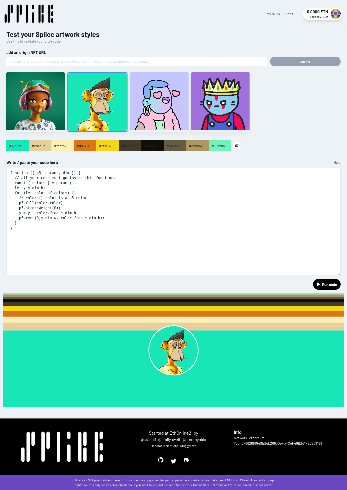

# Splice for artists

If you're a generative artist interested in creating a Splice style NFT, welcome! Below is an outline of how Splice works, and how we can work together. If you have questions that remain unanswered, or if you want to get started building with Splice, please don't hesitate to contact us on [our discord](https://discord.gg/JhtT87y2BA). 

## Writing style code

We're currently supporting style code that has been written using the [p5 library](https://p5js.org/). All styles follow the same boilerplate:

```ts
import p5Types from 'p5';

type RGB = [number, number, number];

interface DrawProps {
  p5: p5Types;
  params: {
    colors: Array<{
      color: p5.Color,
      freq: number, //the overall ratio of this color in the original NFT, e.g. 0.42
      hex: string, //e.g. #7f9b8b
      rgb: RGB //the RGB bytes, e.g. [127, 155, 139]
    }>
  }
  dim: { w: number; h: number };
}

function ({ p5, params, dim }: DrawProps) {
  //your code goes here
}
```
Splice style code **mustn't** rely on global variables but must use the injected p5 variable which is an initialized p5 rendering context, sized as `dim`. A few non trivial examples of how to use it can be found [in our repository](https://github.com/SpliceNFT/splicenft/tree/main/renderers). Note, that we earlier also passed a plain `colors` array of RGB data into the render function but you shouldn't rely on that.

A really simple (but not pretty) example is our flower code:

```js
function ({ p5, params, dim }) {
  const { colors } = params;
  const primaryColor = colors[0];

  p5.background(primaryColor.color);

  const otherColors = colors.filter((c, i) => i != 0);
  // A design for a simple flower
  p5.translate(dim.w / 2, dim.h / 2);
  p5.noStroke();
  for (let i = 0; i < 10; i++) {
    const color = otherColors[i % otherColors.length];
    p5.fill(color.color);
    p5.ellipse(0, 0, 50, dim.w / 1.2);
    p5.rotate(p5.PI / 10);
  }
  p5.noLoop();
}
```

## Ownership and deployment

Styles on Splice are minted as NFTs that can be bought and sold. All fees that accrue when collectors mint Splices, or sell minted results on secondary markets, will be escrowed for the **current style NFT owner** and can be claimed / withdrawn at any time. 

When deploying a style, its metadata and code is stored on IPFS. Right now, artists cannot deploy or mint new style NFTs on their own but must rely on trusted *style minter* roles who deploy style NFTs on behalf of their artists. Once minted you can sell or transfer your **style NFT** as you like. A style NFT isn't just a new kind of asset that potentially generates a stream of revenue from primary and secondary sales, but more importantly, a new way for artists to benefit from their work.

## Commissions and fee distribution

The Splice contract distributes 85% of primary sales to the artist (or whoever owns the style NFT) and 15% to the platform protocol. On secondary sales, the artist (or whoever owns the style NFT) receives 90% of the selected royalty commission (set to 10% on OpenSea).

The Splice contract implements the [EIP-2981 NFT Royalty Standard](https://eips.ethereum.org/EIPS/eip-2981) that signals secondary marketplaces who should receive royalties. EIP 2981 is a rather new, non-binding way that's not picked up by major platforms like OpenSea yet but likely will lead the effort to streamline royalty payments. 

All royalty payouts that happen to be paid to the contract owner directly (which is the Splice protocol) in the old-fashioned way will be forwarded to artists on a monthly basis.

For security reasons, all fees are kept safe by an inline trustless escrow. It pays out all accrued funds on request (see `Splice.sol:claimShares`) 

## The creators' playground

A playground to test style code with arbitrary inputs can be found at [https://getsplice.io/#/create](https://getsplice.io/#/create). Note that you must switch your wallet to mainnet to use the playground's color extraction features. 



## Complex style code

While you *could* write your style using Typescript, that would add another layer of complexity: the style code itself is instantiated inside a browser context, and if it contains TS, it would  fail to load. If you're building a style using TS, you'll need to make sure  your code is transpiled to Javascript before we can mint it. If you don't want to wrap your head around that, just write styles in plain JS.

## How to get your style algorithm on Splice 
After you've written and tested your code, send us:<br /> - Your eth wallet address to receive revenue from sales
<br /> - Your style code
<br /> - The cap on your series (how many can be minted)
<br /> - Its price 
<br /> - Metadata text 


[Here](https://github.com/SpliceNFT/splicenft/blob/main/renderers/District1618/metadata.json) is an example of Splice metadata:
<br /> 
{ <br /> 
  "name": "District 1618", <br /> 
  "description": "District 1618 generates a pattern based on the droste effect and golden mean (1.618).", <br /> 
  "properties": {}, <br /> 
  "splice": { <br /> 
    "creator_name": "Splice Genesis", <br /> 
    "creator_twitter": "https://twitter.com/splicenft", <br /> 
    "creator_url": "https://getsplice.io", <br /> 
    "code_library": "p5.js", <br /> 
    "code_library_version": "1.4.0", <br /> 
    "license": "CC BY-NC-ND 4.0" <br /> 
  } <br /> 
} <br /> 

**Excited to see what you build!**
