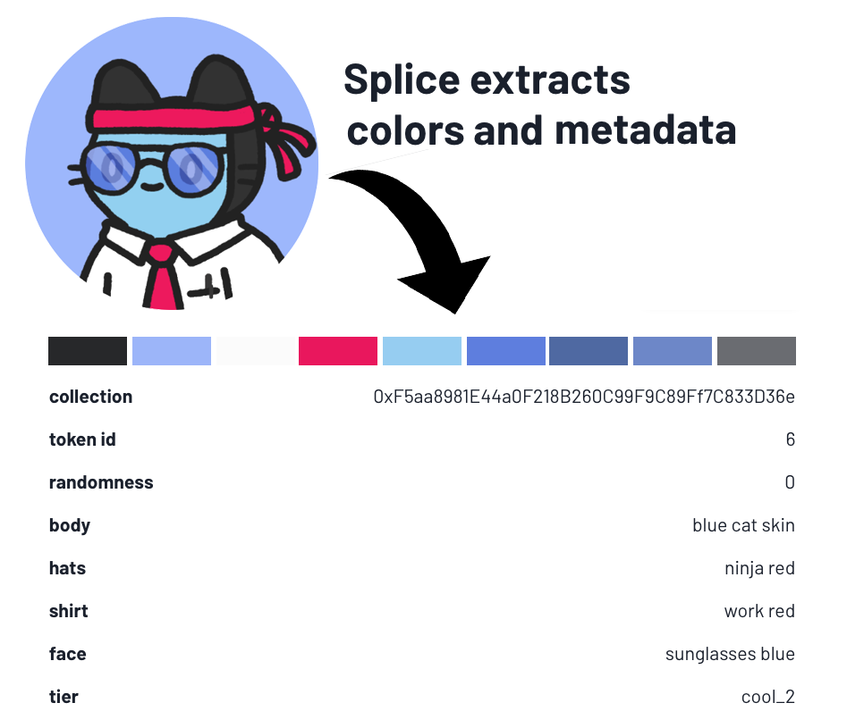
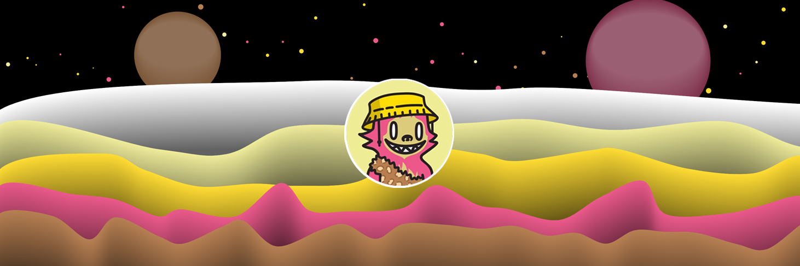

# Splice creates generative art for the NFT metaverse
 
NFTs make great profile pictures. Showing off your NFT as a profile picture, preferably on Discord, makes you part of the gang! Large communities grow around NFT collections,  and invent derivative value - like [elementary pet companions](https://mobile.twitter.com/coolcatsnft/status/1459302026077110274) for cool cats, [derivative works](https://opensea.io/collection/mutant-ape-yacht-club) on BAYC or [Doge puppies](https://opensea.io/collection/doge-pound-puppies-real).

These derivative elements can form a metaverse where NFT communities flourish – a world of playspaces, workplaces, games, weapons, tools, accessories etc. So that's a great vision, but currently there aren't good tools to make it happen.

That's where Splice comes in.

Splice generates **building blocks for metaverse creation**. When you input your NFT, Splice extracts its features and metadata to seed a new derivative work of art. The most obvious and immediate usecase: **header images** for places like Twitter and Discord, where the NFT community currently gathers. Anyone who owns an NFT can create a matching header image on Splice.

## How it works

First, you choose an NFT that you already own. In theory that can be any NFT, but PFP collections like Cool Cats, Doodles or Bored Apes work best. 

Next, Splice extracts the dominant colors of that NFT's palette, and computes a random number by combining the origin collection's contract address and the input token's id. This random number defines unique qualities of the generated art (e.g. the position of shapes on the canvas, thickness of line stroke, etc.)

Finally, you choose an art style from a selection of styles created by various generative artists. Splice seeds that style with your NFT's palette and random number to generate a new work of art.

To recreate the artwork for a minted Splice token, one simply extracts the origin information and the chosen style id, downloads the style NFT code from IPFS and recreates the rendering in another browser window. 

Splices are immutable by design. The code for generative styles is stored on a tamper-proof and unstoppable storage layer ([IPFS](https://ipfs.io/)) and the generative art relies on deterministically computable input parameters. 

## Our Vision

Minting header images is just how Splice gets started. Under the hood it can do much more than that. Our smart contracts accept more than one origin NFT, so generative artists can write code that combines two (or more) NFT seeds to breed something completely new. 

And it's not restricted to PFP collections. Artists could use the Splice protocol to combine a Decentraland estate, a Cool Cat and a Loot token to create a dedicated artwork, a background story or a new character of a cat adventure game. Building this kind of game mechanic usually requires a lot of individual coding, but Splice lowers the barrier to entry by verifying proof of ownership of a seed NFT, and giving artists an easy tool to write code that responds to a seed NFT's origin traits and attributes.
