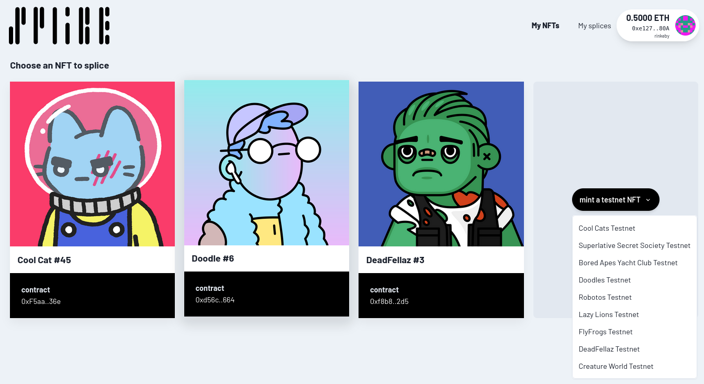
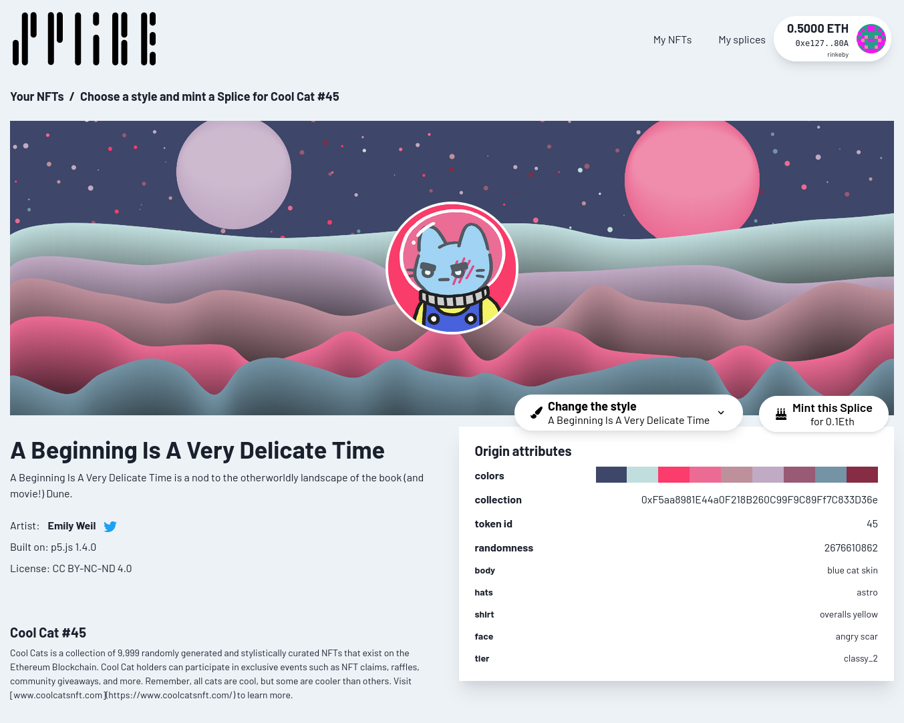
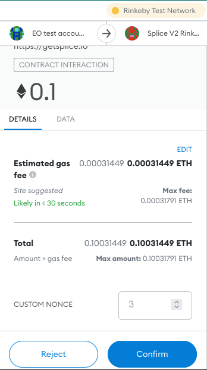
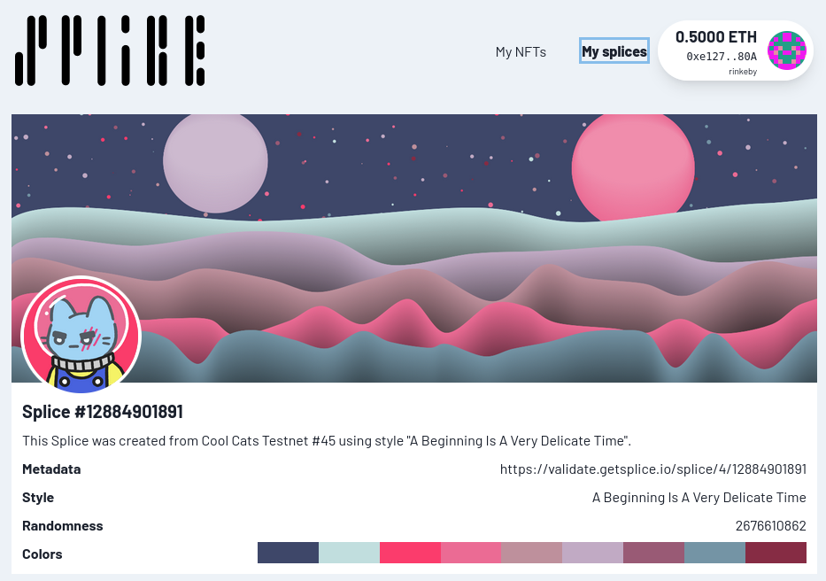
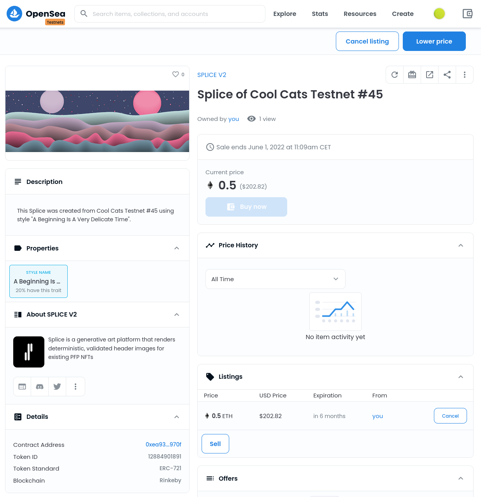
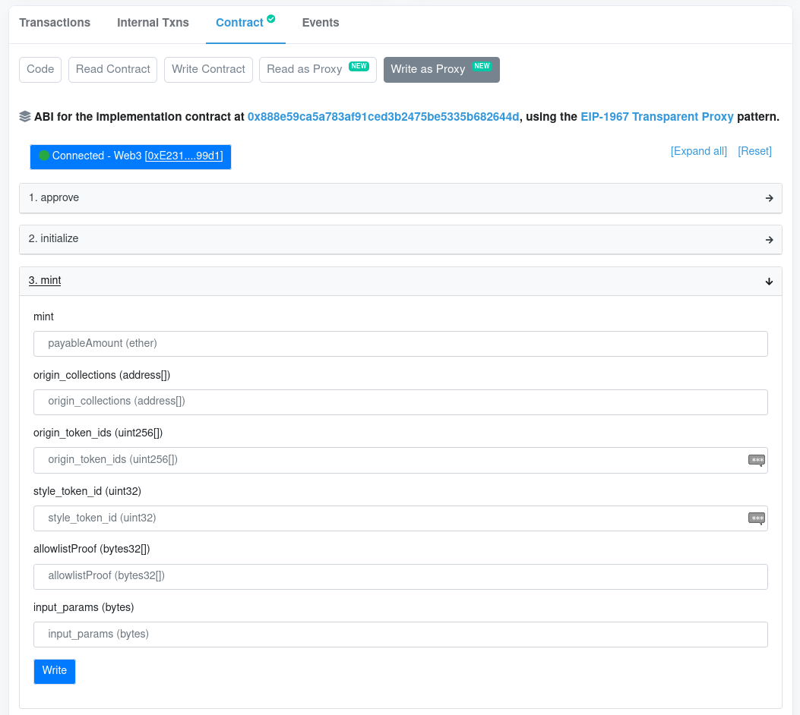
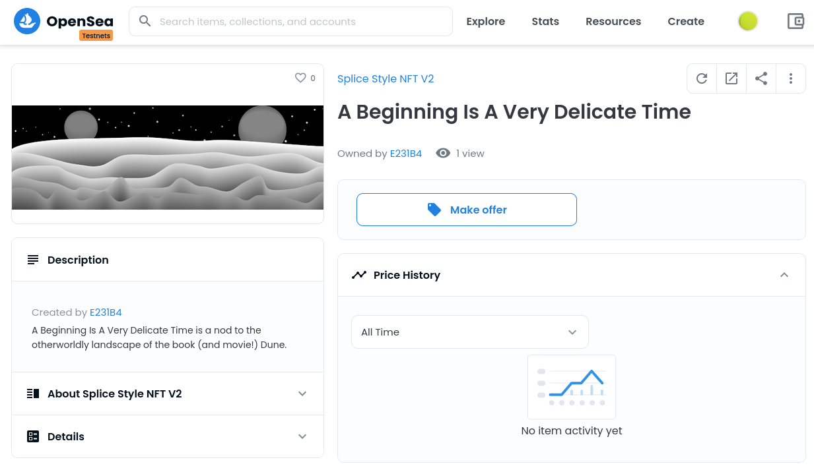

# User Guide

Visit our main page and connect a wallet to a supported network. Proceed to the "[My NFTs](https://getsplice.io/#/my-assets)" page that displays all NFTs you own on the connected network. On Rinkeby you can mint some selected testnet NFTs free. Note, that in order to make use of Ethereum testnets you'll need some testnet Ether which you can [get for free by testnet faucets](https://faucet.paradigm.xyz/).

### Selecting or creating origin NFTs

On testnets not all of your collected NFTs may show up. That's due to limitations of the indexers we're using. In fact, on testnets we're only scanning collections that we're aware of for your assets. On Mainnet we're using [NFTPort](https://www.nftport.xyz/) to discover and display all your assets.

### Minting a Splice

Once you've found an NFT you'd like to splice, you head over to its detail page and wait for the image to load. Depending on the origin's pixel dimensions this can take a while because we must load the original artwork (likely to be stored on IPFS) and extract its predominant colors. We're also calculating a seed for the style's random number generator out of the origin collection's address and the origin token's ID.

When all deterministic parameters have been extracted you can choose a style for your Splice. We're downloading the chosen style's code from IPFS (in practice we're using a cached version to speed things up), apply the extracted parameters to it and display the rendered result immediately on that page. 

If you like the result, you can decide to mint it as a Splice NFT. Each style may have a different minting cap and pricing strategy, determined by the protocol and the style artist. Our three initial styles use constant minting fees.

### View your Splices

You can see all Splices you own when visiting the "[My Splices](https://getsplice.io/#/my-splices)" page. It's showing the used style for each item, the computed randomness and the tokenURI the Splice contract yields for a splice.

You also can view your Splices on marketplace applications, e.g. on OpenSea. Splice derivatives are compatible to the [ERC-721](https://ethereum.org/en/developers/docs/standards/tokens/erc-721/) standard and are therefore tradeable like any other NFT asset.

Splice differs from usual NFT "collectibles" as the rarity and scarcity of a style collection can not be predetermined before its minted out (Splice's users are defining the assets themselves). Therefore we cannot rely on IPFS to freeze a splice image immediately after minting (something we actually tried to do in the beginning). Instead, the metadata is hosted / generated on a backend that we're hosting (`https://validate.getsplice.io`). 

But that's not really a "centralized" tradeoff: since all styles, their code base and your origin NFT (hopefully) are stored on IPFS, you can deterministically recreate your Splice using any modern browser at any time. At the time of writing we haven't enabled the fully decentralized rerendering feature on our page but we're planning to offer a dedicated package that'll enable you to easily recreate all artworks at any time without any dependency on any backend service other than IPFS.

## Minting Rules and Provenances

We thought a long time about the best rules on what can be minted. First, it's possible to mint more than one Splice of an origin. For obvious reasons it's not possible to do so using the same style, i.e. the combination of [origin collection - origin token id - style token id] is the **unique key** that identifies a splice - we also refer to this combination as **provenance**.

On the other hand we've prepared the Splice contract to be future ready: technically it's already possible to use **more than one origin NFT** as an input. We haven't written style code and style interfaces that make use of this feature yet but that's something that our artists can make use of very soon.

## Interacting with Splice contracts directly

Splice is a public ERC721 contract, so you are encouraged to read its source code or interact with it using your preferred chain explorer or command line tool. We deployed the main Splice contract using OpenZeppelin's [upgradeable base contracts](https://docs.openzeppelin.com/upgrades-plugins/1.x/writing-upgradeable) and verified its sources on Etherscan as Transparent Proxy. 

### Contract addresses

#### Rinkeby

Splice base contract: [0xEa934c468e6c8c0C60E6E62797ae57dBD601970f](https://rinkeby.etherscan.io/address/0xEa934c468e6c8c0C60E6E62797ae57dBD601970f#code)  
Splice Style NFT: [0x25a82392fd023f741900a3953468d08246204d5c](https://rinkeby.etherscan.io/address/0x25a82392fd023f741900a3953468d08246204d5c#code)  
Static Price Strategy: [0x6c429D0801F18849563A235A046882482a739a3f](https://rinkeby.etherscan.io/address/0x6c429D0801F18849563A235A046882482a739a3f#code)  

## Roles and Governance

Splice tries to become an open ecosystem for derivative generative art. We discussed a lot about which roles actually should be in charge of deploying new styles or control a styles' settings. We came up with a rather controlled approach that can be loosened for much more decentralized (DAO based) governance in the future.

### Owner

Right now all contracts are owned by us as maintainers. The most important right the owner role bears is to **pause** the Splice contract, effectively disabling new mints and transfers. This is necessary (and a very common practice) to be able to stop operations and upgrade contracts when attackers abuse flaws they found in our source code. Besides that important technical implication, the contract owner bears two additional rights: she can decide which account receives or loses the *style minter* role. The owner of the Splice protocol also decides about the share of minting fees between artists and the platform beneficiary. 

### Curator

An account bearing the styke minter role may mint new style NFTs at any time. Style minting is a non trivial and "dangerous" task since once minted many characteristics of a style can never be changed again (e.g. the overall cap of a style). We've been orienting on the curation aspects of other generative art platforms here which decide together with their artist which styles will be available to mint on their protocols (e.g. ArtBlocks).

### Artist

Artists are writing the generative code for Splice. Their code can only be minted as a style NFT by style minters. Together with their style minter artists decide about the aspects of their style collection: together they decide about pricing and cap (max. amount of mints) of a style. An artist becomes the first owner of a style token after its minted. 

### Style Owner

Users will have to pay a certain fee during the Splice minting process that's split between a platform beneficiary (15%, see below) and the **current holder** of the style NFT (85%). Since style NFTs are transferrable, that holder is not necessarily the original artist anymore - artists instead can sell their NFT with a forward looking price tag. 

### Platform Beneficiary

Splice takes a 15% share of all minting fees. Instead of simply sending that cut to the owner of all Splice contracts we instead decided to introduce a dedicated *platform beneficiary* role that's allowed to withdraw the platform cut. This allows us to seperate monetary concerns from technical ones (even though currently the owner is able to denominate the beneficiary).

## Withdrawing funds

Minting fees are **not** transferred to the beneficiaries upon minting. Instead we're following [well known and recommended best practices](https://consensys.github.io/smart-contract-best-practices/recommendations/#favor-pull-over-push-for-external-calls) and make use of an internal fee escrow that accrues funds on behalf of the beneficiaries. Each role that's eligible and got funds on it may withdraw them at any time by calling the `Splice.withdrawShares` method (but beware that this needs a small amount of Eth on the caller's side to pay for gas).

## Freezing styles

We have implemented a freeze feature on the style contract that can be called by style minters when the cap of a collection has been reached (i.e. it's fully minted). The style minter will first have to create a directory containing all metadata and splice renderings and add (ideally pin) it to IPFS. The resulting directory hash is then used by the Splice contract's `tokenURI` method. Frozen styles cannot be unfrozen again so all metadata can be considered final and unchangeable from that point.

