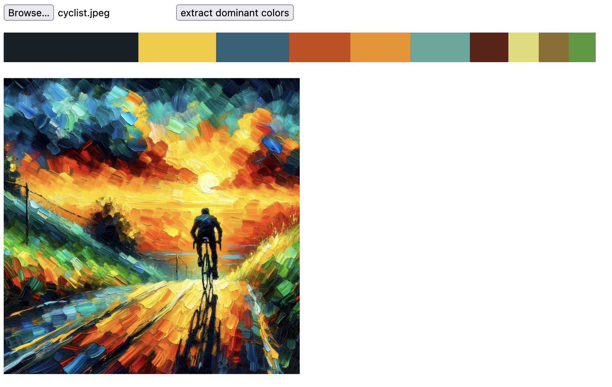
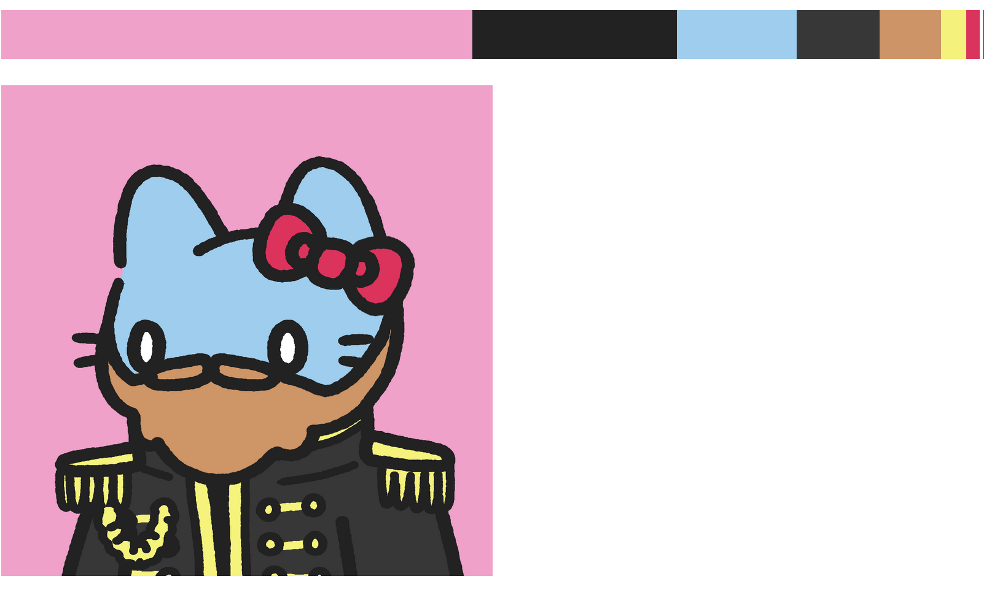
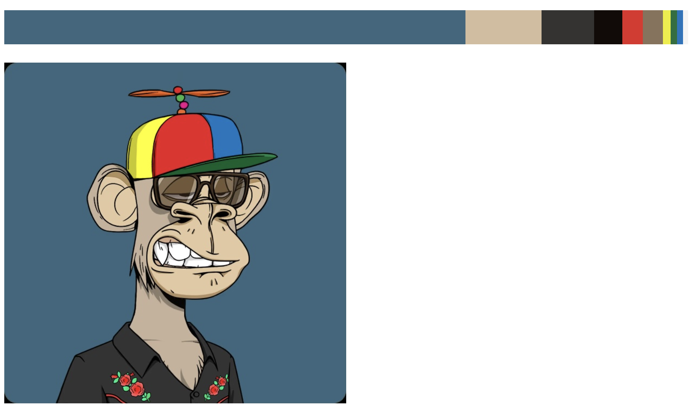

# load dominant colors from an encoded image

- built in Rust / wasm-pack
- uses Rust's [`image` crate](https://crates.io/crates/image) to load image rgb data (only JPG, GIF, PNG supported here for reduced pkg size)
- JS clients just call it with the plain encoded image as Uint8Array
- uses [`k-means colors`](https://crates.io/crates/kmeans_colors) color distribution estimation
- return color frequencies on the image
- works in browsers & node envs
- downsamples an image to a max edge length of 500px before starting the algorithm

Response looks like

```json
[{
  "freq": 0.42347198724746704,
  "hex": "#fc9144",
  "rgb": [
    252,
    145,
    68
  ]
},...],
```

### Usage

I'm exposing some parameters of the underlying k-means algorithm: 

- `runs` run the algorithm more than once with different startin points to avoid local minima (1 should mostly be good) 
- `k` the amount of colors to be extrated, runs (depends on your needs, 10 is ours)
- `max_iter` the amount of iterations on the k-means algorithm (20 is good)

Here's the [official docs](https://docs.rs/kmeans_colors/latest/kmeans_colors/#calculating-k-means). 


## React
```tsx
import { Color, get_dominant_colors } from 'dominant-palette-kmeans';
import { ChangeEvent, useCallback, useState } from 'react';

export default function Home() {

  const [imageData, setImageData] = useState<{bytes: Uint8Array, preview: string}>();
  const [palette, setPalette] = useState<Color[]>();

  const onSelected = (e: ChangeEvent<HTMLInputElement>) => {
    if (!e.target.files) return;
    const selectedFile = e.target.files[0]
    const reader = new FileReader();
    reader.onload = (event) => {
      if (!event?.target?.result) return;
      const blob = new Blob([event.target.result], { type: selectedFile.type });
      setImageData({
        bytes: new Uint8Array(event.target.result as ArrayBufferLike), 
        preview: URL.createObjectURL(blob)
      });
    };
    reader.readAsArrayBuffer(selectedFile);
  };

  const extractColors = useCallback(() => {
    if (!imageData) return;  
    get_dominant_colors(imageData.bytes, 2, 10, 20).then(setPalette)
  }, [imageData, setPalette])

  return (
    <main>
      <input type="file" id="file" name="file" onChange={onSelected}/>
      <button onClick={extractColors}>extract dominant colors</button>
      <p>
      {palette && palette.map((c, i) => {
        return <span key={`c-${i}`} style={{
          display: "inline-block", 
          height: "40px",
          width:`${c.freq * 800}px`, 
          background: c.hex
        }}>
        </span>
      }
      )}
      </p>
      { imageData &&   }
    </main>
  )
}
```

## Node

```ts
import { get_dominant_colors } from 'dominant-palette-kmeans';
import { NextApiRequest, NextApiResponse } from "next";

export default async function handler(req: NextApiRequest, res: NextApiResponse) {
  const response = await fetch(req.query.image_url as string);
  const buffer = await response.arrayBuffer()
  const colors = await get_dominant_colors(new Uint8Array(buffer), 1, 10, 10);
  res.status(200).json({ colors });
}
```

### Build

you'll need wasm-pack for this 

`wasm-pack build`

details on Rust talks to JS (`wasm-bindgen`) -> https://rustwasm.github.io/wasm-bindgen/reference/types/exported-rust-types.html

### Usage in Next.js

We have an accompanying demo app that extracts colors client side. It also comes with an API route that fetches files from a remote location and extracts its colors. 

This is built using wasm-pack's default bundler target. You *could* ask wasm-pack to target nodejs or web but then you'd have to initialize the wasm module yourself. I've built this for the (default) bundler context however, so it "just works" when being consumed inside a Nextjs context application. You'll likely have to adjust your Next app's webpack config to support wasm loading, too (next.config.js):

```ts
const nextConfig = {
  //...
  webpack: (config) => {
    config.experiments = {
      asyncWebAssembly: true,
      layers: true,
    };
    return config;
  },
}
```
 



