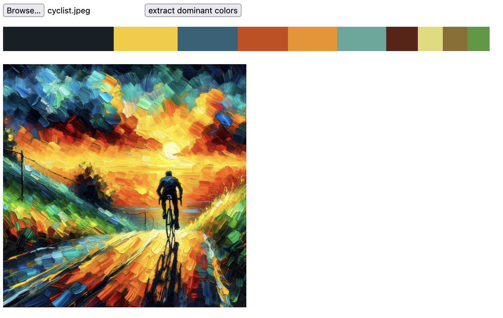

# load dominant colors from an image

- built in Rust / wasm-pack
- JS clients just call it with the plain encoded image as Uint8Array
- uses Rust's [`image` crate](https://crates.io/crates/image) to load image rgb data (only JPG, GIF, PNG supported here for reduced pkg size)
- uses `k-means` color distribution estimation
- return color frequencies on the image
- works in browsers & node envs
- downsamples an image to a max edge length of 500px before starting the algorithm

Response looks like

```json
[{
  "freq": 0.42347198724746704,
  "hex": "#fc9144",
  "rgb": [
    252,
    145,
    68
  ]
},...],
```

### Build

you'll need wasm-pack for this 

`wasm-pack build --target web`

details on Rust talks to JS (`wasm-bindgen`) -> https://rustwasm.github.io/wasm-bindgen/reference/types/exported-rust-types.html

### Demo Next App

Check out the accompanying demo application that extracts colors client side. It also comes with an API route that fetches files from a remote location and extracts its colors. Also check [its README file](./demo-app/README.md) on how to configure your next.config.js

```bash
cd demo-app
npm install
npm run dev
```


